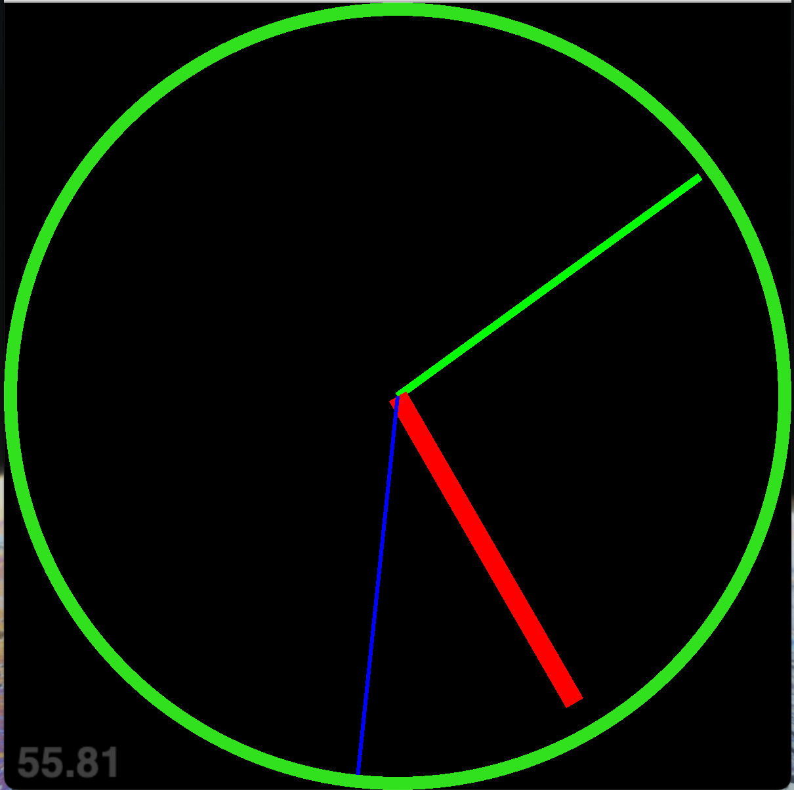

<pre>
1- Install vscode
2- Install `code runner` plugin for vscode
1- Install python 3.8+ 
2-  * Linux, Macos `pip3 install -r requirement.txt`
    * Windows `python3 -m pip install -r ./requirement.txt`
3- Go to any folder you want `cd folder-name`
5- `python3 main.py` or play run icon(little triangle) from `code runner`
</pre>

